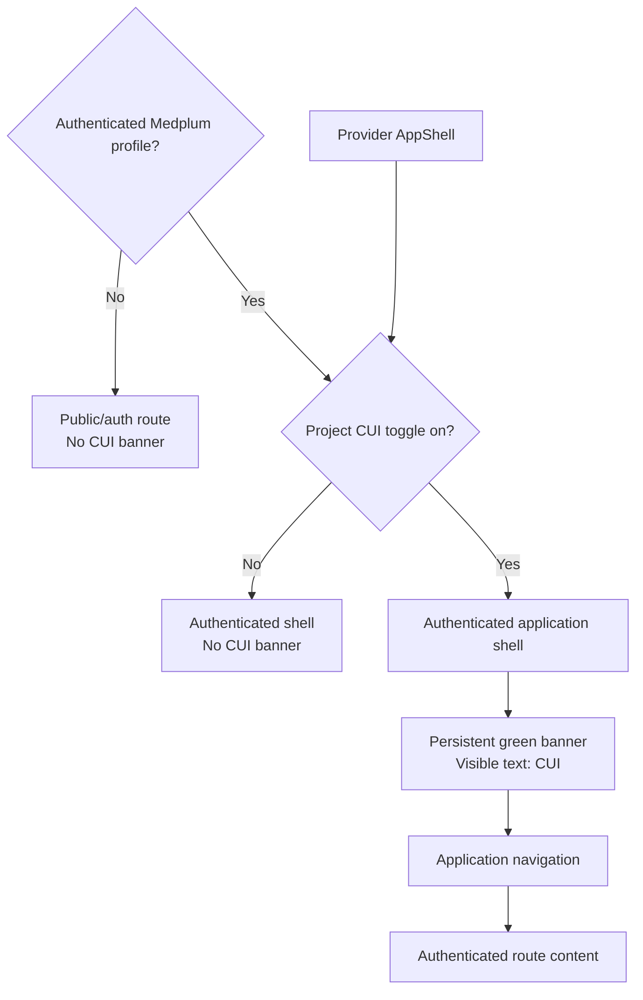
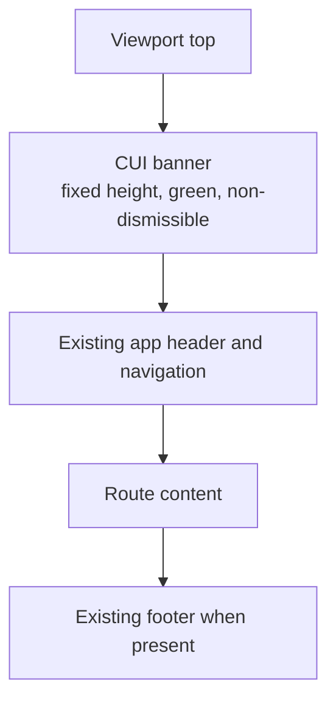

# CUI Banner Implementation Plan

<!-- JIRA EPIC: ARM-9 - CUI Banner Implementation -->

## Objective

Display a persistent, non-dismissible green classification banner across every
authenticated page in the Medplum Provider application.

The first release is Provider-only. Patient and UBIX admin application support
is explicitly deferred to separately planned follow-on work.

The banner's entire visible text is exactly:

```text
CUI
```

It is an application-shell security classification control. It is not a FHIR
resource, patient datum, alert, notification, consent, or login acknowledgement.

## Configuration Decision

The CUI banner should be configurable in the first release because
classification policy differs by customer. Configure it per Medplum `Project`,
not per user, browser, session, or route.

An authorized project security administrator controls one policy toggle:

```text
Show CUI banner on authenticated pages  [ On / Off ]
```

When `On`, the banner is mandatory and non-dismissible on every authenticated
Provider page for that project. When `Off`, Provider renders no banner. A user
cannot override either state.

## Required Behavior

- Render only after authentication succeeds.
- Remain at the top of every authenticated Provider route, including patient
  charts, resource pages, settings, and error pages inside the app shell.
- Render above application navigation and page content.
- Be non-dismissible: no close button, keyboard shortcut, preference, cookie,
  local-storage flag, or route transition can hide it.
- Display only `CUI`; do not spell out the classification or add descriptive,
  help, tooltip, or screen-reader-only text that changes the visible label.
- Preserve the existing login, registration, password-reset, OAuth, MFA, and
  other unauthenticated routes without the banner.
- Reserve stable layout space so navigation and content never render underneath
  the banner or shift during route transitions.

### Administrator Toggle Mock UI

This is an authenticated project-security setting, not a control in the banner
itself. The banner still contains only `CUI`.

```text
Project Administration / Security Controls
-------------------------------------------------------------------------------
Information Classification

Show CUI banner on authenticated pages                         [ On ]

                                      [ Cancel ] [ Save security policy ]
```

The setting is visible and editable only to authorized project security
administrators. Toggling it changes the project policy; it does not add a
dismissal preference for any user.

## Architecture

The feature is a Provider presentational component with an authenticated-shell
mount and one project-scoped policy.

## Mock UI Example

This is a static layout reference. `CUI` is the banner's only visible text.

```text
+----------------------------------------------------------------------------+
|                                    CUI                                     |
+----------------------------------------------------------------------------+
| Hiive Health                         Search                         Profile |
+----------------------------------------------------------------------------+
| Navigation |                                                            |
|            |  Authenticated route content                              |
|            |                                                            |
|            |                                                            |
+----------------------------------------------------------------------------+
```

The green band is part of normal authenticated shell layout. It has no close
button, action, menu, tooltip, secondary label, or user preference.



### Component Contract

Create one shared `CuiBanner` presentational component. Its contract is
intentionally narrow:

```tsx
<CuiBanner />
```

It accepts no dismissal callback, no arbitrary label, and no application-level
state. It renders a full-width green landmark with the text `CUI` centered. Use
one shared CSS/token definition for the approved green, contrast, height, and
z-index. The banner must not use a general notification, alert, or toast
component, because those primitives commonly support dismissal and transient
behavior.

The shared component can live in the released `@medplum/react` package, provided
the provider and patient applications are aligned to that release. If dependency
alignment is deferred, ship identical, minimal local components with a tracked
consolidation follow-up. Do not duplicate application-specific business logic.

### Project Policy Source

Store `cuiBanner.enabled` in one profiled project-scoped configuration resource
or extension. The resource is readable by authenticated members of its project
and writable only by project security administrators and designated platform
operators through a Medplum `AccessPolicy`. Provider reads this configuration
directly through its normal authenticated Medplum client during application
bootstrap; no separate policy API, service credential, proxy route, or
project-to-configuration mapping is required.

Do not use an environment variable when different customer projects share a
deployment, and do not use a client-only feature flag because it could diverge
between users. The Boolean is not confidential; its server-enforced update
permission is the security boundary.

### Authenticated-Only Mount

| Application | Mount point | Gate |
| --- | --- | --- |
| Provider | First child within `AppShell`, before routed content | Render when `useMedplumProfile()` returns a profile and the resolved project policy is enabled. |

The banner itself creates no patient, clinical, or audit-specific data and does
not grant or restrict clinical access. The project policy resource is
intentional FHIR configuration data, protected by an AccessPolicy.

## Development Team Discussion: Policy Resolution Failure

**Approved product decision:** if Provider cannot read the project CUI policy,
it must not render authenticated navigation, patient information, or route
content. It must instead show a security-configuration-unavailable screen with
a retry action until the configuration can be read.

This prevents Provider from silently omitting a required classification banner
and avoids incorrectly showing `CUI` for a project whose policy may be off.

**Discuss before implementation:**

- The approved screen copy, retry behavior, and accessibility treatment.
- Timeout, telemetry, alerting, and operational ownership for configuration
  read failures.
- Whether a previously resolved policy may remain active for an existing session
  during a transient refresh failure, and the maximum permitted duration.

## Layout And Accessibility



- Use a semantic landmark such as `header` or `aside` with a stable accessible
  name, while its rendered text remains only `CUI`.
- Meet WCAG AA contrast requirements for the selected green and text color.
- Give the banner a fixed height across breakpoints. The `CUI` text must not wrap
  or truncate at supported widths.
- Keep it in normal shell layout, not `position: fixed`, unless each application
  also reserves the exact offset. Normal layout avoids content occlusion and
  scroll/focus problems.
- It must not capture focus, announce repeatedly during client-side navigation,
  or interfere with modal focus traps.
- It must stay present in loading, empty, error, and authorization-denied views
  once a profile is authenticated.

## Work Slices

### Slice 1: Provider Classification Standard [ARM-10]

**Deliverable:** one approved visual, accessibility, and policy specification.

- Confirm the security owner approves the exact rendered text `CUI`, green
  token, text color, height, and customer applicability.
- Define the Provider project-scoped `cuiBanner.enabled` policy and the
  security administrator role allowed to update it.
- Define the banner's landmark, accessible name, z-index policy, and responsive
  dimensions; publish desktop and mobile visual references.

**Verification criteria:** the specification states that the only visible text
is `CUI`, contrast passes, the control has no dismissal behavior, and the policy
is enabled or disabled only at the project level.

### Slice 2: Project Security Policy [ARM-11]

**Deliverable:** a protected, project-scoped `cuiBanner.enabled` configuration
with an authorized administrator toggle.

- Add the profiled configuration field or Project extension and default it to
  `false` for projects without an explicit policy.
- Use a Medplum `AccessPolicy` so authenticated project members can read the
  setting while only project security administrators and platform operators can
  update it.
- Make the setting available through the profile-driven project configuration
  editor. A custom security settings screen is optional and not required for
  the first release.
- Provide a configuration status for each application shell to consume after
  authentication.

**Verification criteria:** an authorized administrator can set the project
toggle on and off; an authenticated member can read but cannot update it; the
policy resolves consistently for all authenticated Provider routes.

### Slice 3: Shared Presentational Component [ARM-12]

**Deliverable:** a tested `CuiBanner` component in the shared UI package or a
tracked temporary equivalent in each application.

- Render exactly `CUI` in the approved full-width green surface.
- Expose no props that allow callers to hide, change, or dismiss the banner.
- Add component tests for text, semantic landmark, accessible name, absence of
  buttons, and class/token application.

**Verification criteria:** unit tests prove only `CUI` is visible and there is
no interactive dismissal control or state transition.

### Slice 4: Provider Authenticated Shell [ARM-13]

**Deliverable:** CUI appears on every authenticated provider route for enabled
projects and never on the provider sign-in route.

- Mount the component inside the provider `AppShell`, gated on the loaded
  Medplum profile and enabled project policy.
- Preserve the current route behavior, including unauthenticated redirects.
- Add app-shell tests for authenticated dashboard/chart routes, disabled policy,
  and `/signin`.

**Verification criteria:** browser smoke test changes among dashboard, patient
chart, resource/error, and settings routes without removing or overlapping the
banner when enabled; a disabled project and `/signin` remain banner-free.

enabled; public and disabled-project routes remain banner-free.
### Slice 5: Provider Release Verification [ARM-16]

**Deliverable:** deployment evidence that Provider uses the approved component
and security behavior.

- Run the Provider build, focused unit tests, and browser screenshot checks at
  desktop and mobile widths.
- Verify no Provider prop, feature flag, or user setting can dismiss the banner
  when the project policy is enabled.
- Verify that an unavailable policy blocks authenticated content and provides a
  retry path; publish the agreed operational evidence.
- Publish screenshots that demonstrate the persistent banner on representative
  authenticated routes without exposing sensitive patient data.

**Verification criteria:** Provider shows the approved `CUI` text,
non-dismissible behavior, correct authenticated-only visibility when enabled,
no banner when disabled, and no authenticated content while policy resolution
is unavailable.

## Relevant Implementation Surfaces

| Application | Primary files |
| --- | --- |
| Provider | `medplum-provider/src/App.tsx` and its top-level app tests. |

## Acceptance Criteria

- The only visible banner text is `CUI`.
- It appears above navigation and content on every authenticated Provider route.
- It is absent on all unauthenticated, authentication, recovery, and
  registration routes.
- No UI action, keyboard action, route transition, browser storage value, or
  application preference can remove it.
- It stays visible without content overlap or layout shift on desktop and mobile
  viewports.
- It introduces no patient-data, clinical-workflow, authorization, or audit
  side effects. The protected project configuration resource is the only
  intentional FHIR configuration data used by the feature.